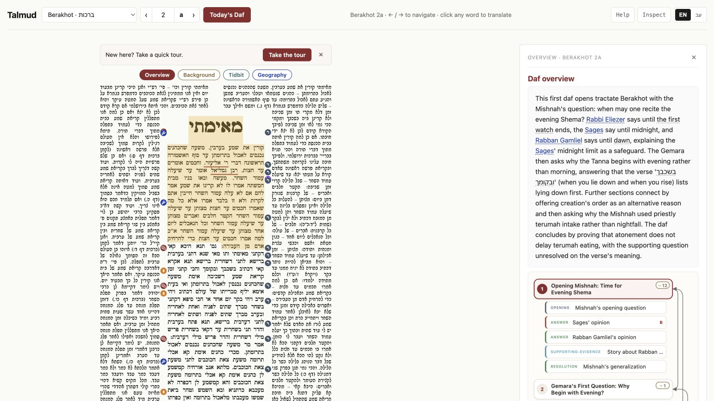

# Talmud

**A daf-first study reader that covers the Vilna page in smart, source-aware notes.**

[Open the reader](https://talmud.dev) · [Take the guided tour](https://talmud.dev/#tutorial) · [See how it works](https://talmud.dev/#howitworks)

[](https://github.com/Shaun-Regenbaum/talmud/actions/workflows/ci.yml)

[](https://talmud.dev)

Talmud.dev keeps the daf at the center of study. It layers explanations and connections onto the text at the place where they belong, while preserving where each note came from, how it was produced, and how precise its placement is.

## What it does

- Renders the Vilna daf with tractate, page, language, and Daf Yomi navigation.
- Pins background, argument structure, practical halacha, Rishonim, citations, geography, people, parallels, and other study aids to relevant text.
- Turns a daf's argument into navigable sections, voice maps, and cross-daf links.
- Supports bilingual notes, word-level translation, commentary, questions, and a guided first-time tour.
- Exposes the same corpus through inspection tools, documented APIs, and an MCP endpoint.
- Shows how the system is working: provenance, dependency graphs, cache state, usage, and generation status are inspectable rather than hidden.

Placement is deliberately conservative: a note may remain attached to the whole daf when the system cannot confidently identify a narrower span. Human corrections outrank generated results and are not silently overwritten.

## How it is built

This is a pnpm workspace with two corpus apps and a shared engine:

| Path | Purpose |
| --- | --- |
| `packages/talmud` | The Solid.js reader and Hono/Cloudflare Workers API at [talmud.dev](https://talmud.dev) |
| `packages/tanach` | A sibling Tanach reader built on the same corpus model |
| `packages/core` | Corpus-agnostic spines, anchors, artifacts, producers, context, caching, and runtime code |
| `packages/ui` | Shared components and design tokens |

The core model is simple: an addressable text **spine** is covered by typed **artifacts**, each attached with an **anchor** and created by a registered **producer**. Read [the framework](docs/framework.md) for the detailed model and [the source guide](docs/sources.md) to add a study source.

## Start contributing

Requirements: Node.js 22+, [pnpm 9.12.1](https://pnpm.io/), and Git.

```bash
git clone https://github.com/Shaun-Regenbaum/talmud.git
cd talmud
corepack enable
pnpm install --frozen-lockfile
pnpm typecheck
pnpm test
```

That is enough to make and validate documentation, UI, engine, and test changes. Running the complete local Talmud reader also requires an authenticated Wrangler session because two development bindings use Cloudflare remotely:

```bash
pnpm exec wrangler login
pnpm dev
```

AI generation, admin routes, and production operations require project credentials; ordinary contributors do not need them to run the test suite or build the workspace.

Looking for a first contribution?

1. Read [CONTRIBUTING.md](CONTRIBUTING.md) for the branch and validation workflow.
2. Browse [`good first issue`](https://github.com/Shaun-Regenbaum/talmud/issues?q=is%3Aissue+is%3Aopen+label%3A%22good+first+issue%22) and [`help wanted`](https://github.com/Shaun-Regenbaum/talmud/issues?q=is%3Aissue+is%3Aopen+label%3A%22help+wanted%22), or [open an issue](https://github.com/Shaun-Regenbaum/talmud/issues/new) with a bug or study-reader idea.
3. Keep changes narrow, add or update tests when behavior changes, and run the checks below before opening a pull request.

```bash
pnpm lint
pnpm typecheck
pnpm test
pnpm build
```

Production deploys automatically after a change is merged to `master` and passes CI.
